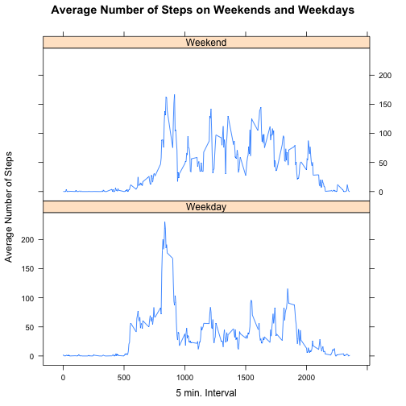

### Loading and preprocessing the data  

1. Loading the activity data while indicating it has a header and that the NAs are recorded as 'NA':   


```r
activity <- read.csv('activity.csv', header = TRUE, na.strings = 'NA')
```

2. Converting date column to date type class in the right format:   


```r
activity$date <- as.Date(activity$date, format='%Y-%m-%d')
```

### What is the mean total number of steps taken per day?  

1. The histogram of the total number of steps taken each day:  

```r
stepsDay <- aggregate(steps ~ date, data=activity, sum)
hist(stepsDay$steps,main = 'Histogram of Total Steps / Day', xlab = 'total steps per day', ylim = c(0,35))
```

 

2. Calculating the mean and median total number of steps taken per day:  

```r
meansteps = mean(stepsDay$steps)
mediansteps = median(stepsDay$steps)
```
*The mean steps taken per day is 10766.19*  
*The median steps taken per day is 10765*   

### What is the average daily activity pattern?  

1. The time series plot (type "l") of the 5 minute interval (x-axis) and the average number of steps taken, averaged across all days (y-axis):  


```r
aveStepsInterval <- aggregate(steps ~ interval, data=activity, mean)

plot(aveStepsInterval$interval,aveStepsInterval$steps,type = 'l', main = 'Time Series of Average Steps', xlab = '5 min. intervals', ylab = 'average steps')
```

 

2. Which 5 minute interval (on average across all days) contains the maximum number of steps?  


```r
intMaxNumSteps = aveStepsInterval[which.max(aveStepsInterval$steps),1]
```
*The 5 min. interval with most steps is on average: 835*  

### Imputing missing values  

1. The total number of missing values in the dataset:  


```r
totalMissing = sum(is.na(activity$steps))
```
*Total number of missing values is: 2304*

2. Devise a strategy for filling in all of the missing values in the dataset.  
*I will use the mean of the 5 minute interval across all days for that 5 min. interval. This utilizes previously calculated vector*


3. Creating a new dataset that is equal to the original dataset but with the missing data filled in:    

```r
activity2 <- activity
naIntervals <- activity2[which(is.na(activity2)),3]
activity2[which(is.na(activity2)),1] <- aveStepsInterval[which(aveStepsInterval$interval %in% naIntervals),2]
```

4. Make a histogram of the total number of steps taken each day and calculate and report the mean and median total number of steps taken per day. Do these differ from the estimates in the first part of the assignment? What is the impact of imputing the missing data?  


```r
stepsDay2 <- aggregate(steps ~ date, data=activity2, sum)
hist(stepsDay2$steps,main = 'Histogram of Total Steps (Imputed) / Day', xlab = 'total steps per day', ylim = c(0,35))
```

 

```r
meansteps2 = mean(stepsDay2$steps)
mediansteps2 = median(stepsDay2$steps)
```
*The mean steps taken per day is 10766.19*  
*The median steps taken per day is 10766.19*  
*These hardly differ from the original estimates. There is little impact when imputing the missing data with this strategy e.g. there is a very slight change in median steps: 1.19 more steps and one bin in the histogram (10000-15000 steps) is notably higher.*  

### Are there differences in activity patterns between weekdays and weekends?  

1. Creating a new factor variable in the dataset with two levels - 'weekday' and 'weekend' indicating whether a given date is a weekday or a weekend day:  


```r
activity2$day <- weekdays(activity2$date)
activity2[which(weekdays(activity2$date) %in% c('Saturday','Sunday')),4]<-"Weekend"
activity2[which(weekdays(activity2$date) %in% c('Monday','Tuesday','Wednesday','Thursday','Friday')),4]<-"Weekday"
activity2$day <- as.factor(activity2$day)
```

2. Creating a panel plot containing time series plot of the 5-min. interval and the average number of steps taken, averaged across all weekday days or weekend days:  


```r
aveStepsInterval2 <- aggregate(steps ~ interval + day, data=activity2, mean)


library(lattice)

xyplot(steps ~ interval | day, 
           main = 'Average Number of Steps on Weekends and Weekdays',
           data = aveStepsInterval2,
           type = "l",
           xlab = "5 min. Interval",
           ylab = "Average Number of Steps",
           layout=c(1,2))
```

 

